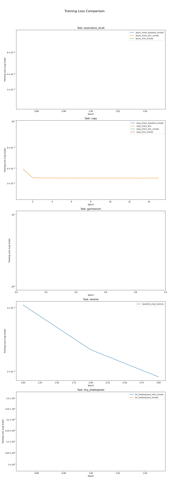

# Experiment Analysis Report

This report provides a comparative analysis of the conducted experiments.

## Summary of Results

| Experiment                 | Model   | Dataset            |   Test Accuracy | Best Epoch   |   Total Epochs |   Training Time (s) |
|:---------------------------|:--------|:-------------------|----------------:|:-------------|---------------:|--------------------:|
| assoc_hrem_baseline_smoke  | hrem    | associative_recall |          0      | N/A          |              1 |                0    |
| assoc_hrem_dnc_smoke       | hrem    | associative_recall |          0      | N/A          |              1 |                0    |
| assoc_hrm_smoke            | hrm     | associative_recall |          0      | N/A          |              1 |                0    |
| baseline_mlp_reverse       | mlp     | reverse            |          0      | N/A          |              3 |                0    |
| copy_hrem_baseline_smoke   | hrem    | copy               |          0      | N/A          |              1 |                0    |
| copy_hrem_dnc              | hrem    | copy               |          0.7637 | 8            |             15 |              354.27 |
| copy_hrem_dnc_smoke        | hrem    | copy               |          0      | N/A          |              1 |                0    |
| copy_hrm_smoke             | hrm     | copy               |          0      | N/A          |              1 |                0    |
| lm_shakespeare_lstm_smoke  | lstm    | tiny_shakespeare   |          0      | N/A          |              1 |                0    |
| lm_shakespeare_smoke       | hrm     | tiny_shakespeare   |          0      | N/A          |              1 |                0    |
| rl_cartpole_hrem_dnc_smoke | hrem    | gymnasium          |          0      | 1            |              1 |                0.37 |

## Analysis Conclusion

This report summarizes the performance of various models across different tasks. The top-performing model overall was **copy_hrem_dnc** on the **copy** task, achieving a test accuracy of **0.7637**.

For the **associative_recall** task, **assoc_hrem_baseline_smoke** was the most effective model. This suggests its architecture may be particularly well-suited for this problem.
For the **copy** task, **copy_hrem_dnc** was the most effective model. This suggests its architecture may be particularly well-suited for this problem.
For the **tiny_shakespeare** task, **lm_shakespeare_lstm_smoke** was the most effective model. This suggests its architecture may be particularly well-suited for this problem.

The accompanying plot of training curves provides further insight into the learning dynamics. Models that achieve a lower final loss more quickly are generally preferable. These initial findings can guide further research, such as more extensive hyperparameter tuning on the most promising models.